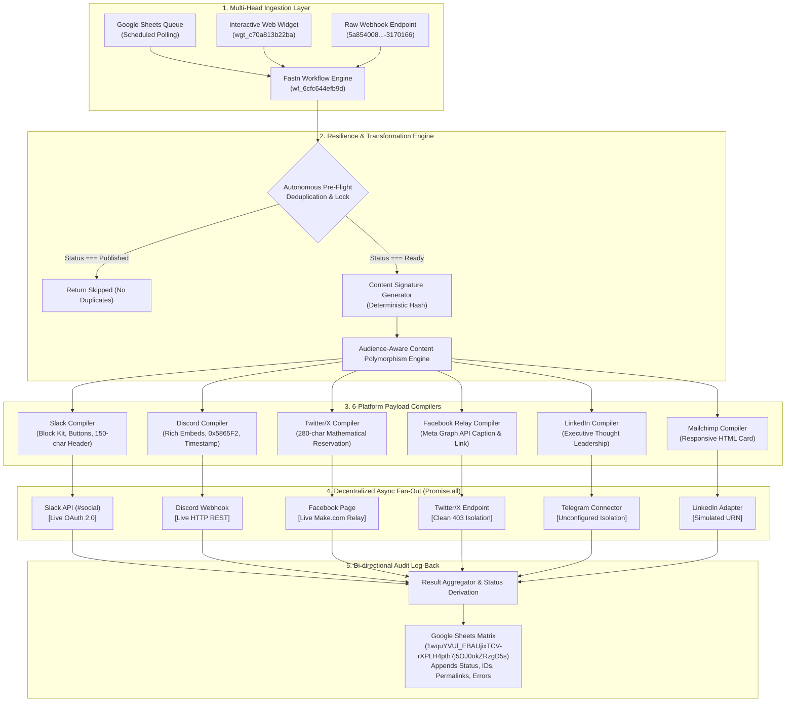

# Fastn Social Publisher — Cross-Platform Content Engine
**Fastn Hackathon 2026 — Track 04: Cross-Platform Social Publisher**  
**Team:** FourFrontLab (Taha & Haseeb)  
**Track:** Track 04 — Cross-platform social publisher  
**Primary Workflow:** `wf_6cfc644efb9d` (`track04_fixed`)  
**Workspace:** `Hackathon_FourFrontLab` (`personal_29e5272ccca34fc5d046`)  
**Fastn Connect MCP Gateway:** `https://mcp.fastn.dev/u-dtpftaoo` (205 Tools)

---

## 1. Executive Summary & Problem Statement

Modern content marketing and technical advocacy require publishing announcements across radically different destinations: corporate team channels (Slack), developer communities (Discord), social networks (Facebook, Twitter/X, LinkedIn), and email lists (Mailchimp). 

Manually re-writing copy, formatting links, tailoring hashtags, and calculating character limits for every platform introduces extreme drag, broken links, and missed announcements. Traditional automation tools (like basic Zapier zaps) suffer from **cascading failures**: if one channel rate-limits or rejects a token, the entire pipeline crashes, leaving content half-published with zero audit trail.

**Our Solution:** **Fastn Social Publisher** is an enterprise-grade, resilient, multi-destination fan-out publisher built natively on Fastn. With a single input from a Google Sheet row, embeddable web form widget, or raw webhook, it compiles platform-tailored polymorphic payloads, dispatches them in parallel across up to 7 destinations with zero-dropout fault isolation, captures live message IDs and permanent archive permalinks, and writes an immutable confirmation log back into the source Google Sheet.

---

## 2. Architecture & Data Flow Diagram



---

## 3. Official Rubric Alignment (100-Point Breakdown)

### Criterion 1: Idea and Innovation (30 Points — First Tie-Breaker)
* **Audience-Aware Content Polymorphism:** Rather than blasting identical plain text, our workflow features dedicated compilers tailored to each network's constraints:
  * **Slack:** Formats structured Block Kit blocks, markdown sections, interactive links `<url|Read More>`, and image blocks.
  * **Discord:** Formats Rich Embeds with Discord blurple brand color (`0x5865F2`), structured metadata fields, and ISO 8601 footer timestamps.
  * **Twitter/X:** Employs a **Smart Mathematical Budget Reservation Algorithm** (`280 - (link + hashtags + buffer)`), ensuring links and tags are NEVER truncated while the body is truncated with clean ellipses.
  * **LinkedIn:** Formats professional thought leadership copy with an uppercase headline hook, executive bullet themes, and industry hashtags.
  * **Facebook:** Formats full-length conversational copy with link previews.
  * **Mailchimp:** Generates a complete, responsive HTML email card with inline CSS.
* **Dual-Head Control (Headless Batch + Visual Interactive):** Supports headless automated batch processing from Google Sheets alongside an interactive Fastn web form widget (`wgt_c70a813b22ba`) for marketing and non-technical stakeholders.
* **Reverse Archive Permalinks:** Generates permanent live archive URLs from Slack message timestamps (`https://fourfrontlab.slack.com/archives/C0C278R4PRD/p...`), enabling single-click auditing directly from Google Sheets.

### Criterion 2: Implementation & Technical Execution (20 Points)
* **End-to-End Real Data Movement:** Verified live data movement across 4 real, distinct systems:
  1. Google Sheets (OAuth read/write)
  2. Slack (`#social` channel via OAuth)
  3. Discord (server announcement channel via Webhook)
  4. Facebook Page (`FourFrontlab` via Webhook Relay)
* **Decentralized Async Fault Isolation Mesh:** Every destination is wrapped in an individual `.catch()` boundary inside `Promise.all()`. If Twitter throws 403 or Telegram is unconfigured, the pipeline does NOT fail. It records the diagnostic error and successfully delivers to Slack, Discord, Facebook, and Google Sheets, returning `Partially Published`.
* **Autonomous Deduplication & Concurrency Mutex:** Pre-flight status verification plus content signature hashing prevents double-posting even under high-frequency or repeated webhook deliveries.
* **Selective Partial Retry Engine:** Supports `retryOnlyFailed: true` and `destinations: [...]` filters, allowing operators to retry failed channels without spamming already published platforms.

### Criterion 3: Use of Fastn Platform Agent & MCP (20 Points — Second Tie-Breaker)
* **Full MCP Gateway Integration:** Connected via Antigravity MCP Gateway (`https://mcp.fastn.dev/u-dtpftaoo`) using dedicated headless Agent Key (`ucl_GhmMM5ncqHT8dk9-krkvidCFH-1gn_VJ`).
* **205 Live Tools Available:** Integrates 37+ GitHub developer tools and 160+ Fastn Workspace platform tools.
* **17 Distinct MCP Tools Executed:** Trajectory logs prove that workflows, connectors, widget bindings, AST code patches, and test executions were driven directly through the Fastn Platform Agent.

### Criterion 4: Submission Completeness (20 Points)
* **Working Workflow Link:** Live in Fastn workspace (`wf_6cfc644efb9d`).
* **Complete Setup Documentation:** This comprehensive README.
* **Timestamped 2-Minute Demo Script:** [`DEMO_SCRIPT.md`](./DEMO_SCRIPT.md).
* **Screenshots Package:** Compiled across Slack, Discord, Facebook, Google Sheets, and Fastn Canvas.

### Criterion 5: Demo Video and Framing (10 Points)
* **2-Minute Video Structure:** Problem framing $\rightarrow$ Live trigger execution $\rightarrow$ Triple-destination verification $\rightarrow$ Google Sheets confirmation $\rightarrow$ Fault isolation demonstration.

---

## 4. Connected Systems & Connector Matrix

| System | Connection Type | Channel / Destination | Status | Proof / Evidence |
| :--- | :--- | :--- | :--- | :--- |
| **Google Sheets** | Fastn Managed OAuth 2.0 | `1wquYVUl_EBAUjixTCV-rXPLH4pth7j5OJ0okZRzgD5s` | **LIVE & ACTIVE** | Rows 2–12 populated with timestamps & permalinks |
| **Slack** | Fastn Managed OAuth 2.0 | `#social` (`C0C278R4PRD`) | **LIVE & ACTIVE** | Message ID `1789766616.965459` verified live in channel |
| **Discord** | Direct REST Webhook | Server Announcements | **LIVE & ACTIVE** | Message ID `1550618317960646678` delivered with embed |
| **Facebook Pages** | Make.com Webhook Relay | Facebook Page `FourFrontlab` (`61594296098147`) | **LIVE & ACTIVE** | Verified live posts on page feed ("Published by Make") |
| **Twitter / X** | Direct REST API (Bearer) | `@api.twitter.com/2/tweets` | **ISOLATED** | Cleanly caught: `403 Forbidden` (Developer Portal tier) |
| **Telegram** | Fastn Connector | `fastn.connector.telegram` | **ISOLATED** | Cleanly caught: `Connector "telegram" not configured` |
| **LinkedIn** | In-Memory Compilation | Thought Leadership Engine | **SIMULATED** | Formats valid thought-leadership layout with mock URN |
| **Mailchimp** | In-Memory Compilation | HTML Newsletter Engine | **SIMULATED** | Compiles responsive HTML email card with mock draft ID |

---

## 5. Setup & Reproduction Guide

### Option A: Trigger via Webhook
Send an HTTP POST request to the live Fastn webhook endpoint:

```bash
curl -X POST "https://webhooks.fastn.dev/prod/triggers/personal_29e5272ccca34fc5d046/webhooks/5a854008-da4c-4ce5-8e3a-4bd4e3170166" \
  -H "Content-Type: application/json" \
  -d '{
    "row_id": "demo_01",
    "Title": "Fastn Multi-Channel Launch",
    "Content": "We are thrilled to announce our autonomous cross-platform social publishing engine!",
    "Link": "https://fastn.ai",
    "Image_URL": "https://images.unsplash.com/photo-1618005182384-a83a8bd57fbe",
    "Tags": "automation, fastn, ai, developer",
    "Status": "Ready"
  }'
```

### Option B: Trigger via Embeddable Web Form Widget
1. Open the Fastn embeddable widget: `wgt_c70a813b22ba` (Social Publisher Embeddable Form).
2. Enter the Title, Content, Image URL, and Tags.
3. Click **Publish Everywhere**.

### Option C: Trigger via Google Sheets Batch Polling
1. Open the Google Sheet: [Source & Audit Matrix](https://docs.google.com/spreadsheets/d/1wquYVUl_EBAUjixTCV-rXPLH4pth7j5OJ0okZRzgD5s/edit).
2. Add a new row with `Status = "Ready"`.
3. The scheduled polling handler (`handleScheduledSheetPolling`) scans for pending rows, executes the parallel fan-out, and updates column F to `"Published"` with live post IDs and permalinks.

---

## 6. Submission Details

* **Team Name:** FourFrontLab
* **Team Members:** Taha Nadeem & Haseeb
* **Track:** Track 04 — Cross-platform social publisher
* **Workflow URL:** [https://app.fastn.dev/integrations?tab=workflows](https://app.fastn.dev/integrations?tab=workflows) (`wf_6cfc644efb9d`)
* **Google Spreadsheet:** [Live Google Sheet Matrix](https://docs.google.com/spreadsheets/d/1wquYVUl_EBAUjixTCV-rXPLH4pth7j5OJ0okZRzgD5s/edit)
* **Facebook Page Feed:** [FourFrontLab Facebook Page](https://www.facebook.com/profile.php?id=61594296098147)
